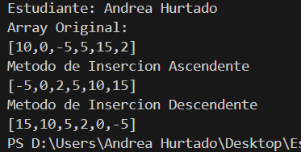
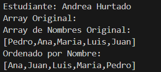
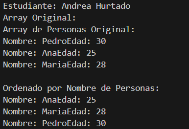
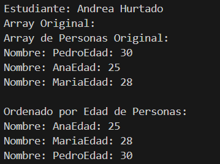

# Estructura de Datos

**Estudiante:** Andrea Hurtado

## Metodos Ordenamiento

### Prática 1 - 20/OCT
Método Sort Bubble

### Prática 2 - 21/OCT
Método Sort Selection en Java y Python

Salida de Python

Salida de Java

### Práctica 3 - 23/OCT
Método Sort Insertion en Java

1. Arreglo de números enteros

2. Arreglo de cadenas (nombres)

3. Arreglo de personas ordenado por nombre

4. Arreglo de personas ordenado por edad

