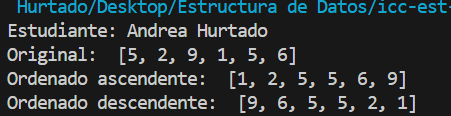
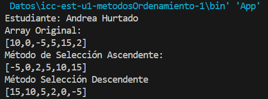

# Estructura de Datos

**Estudiante:** Andrea Hurtado

## Metodos Ordenamiento

### Prática 1 - 20/OCT
Método Sort Bubble

### Prática 2 - 21/OCT
Método Sort Selection en Java y Python

Salida de Python

Salida de Java

